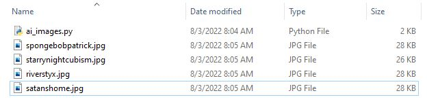

# AI-Images Module
Sends a request to Craiyon AI Image Generator to generate 9 images in Base64 code from a chosen prompt. The program then parses and assembles the Base64 code into 9 JPG files outputted within the main directory.

<h4>Here are some examples:</h4><br />

<p float="center">
  
   
  
  
  
   
  
  
  
</p>

<p align="center">
  
</p>

<h1>Usage:</h1>

```python
Installation:
python3 -m pip install ai_image


Implementation:
from ai_image.ai_image import *

prompt = "example prompt"
ai_images(prompt)
```
