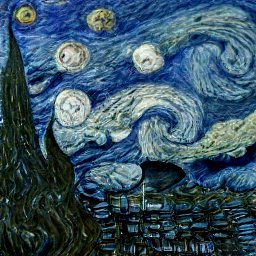
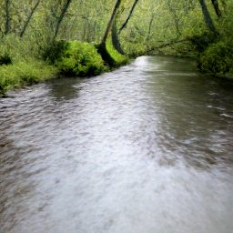
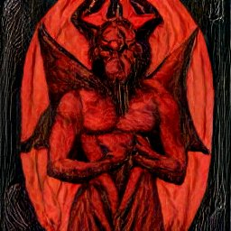
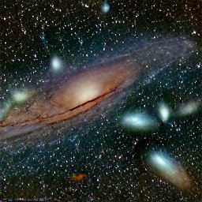
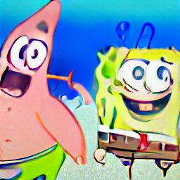
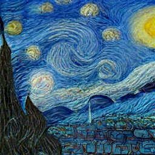
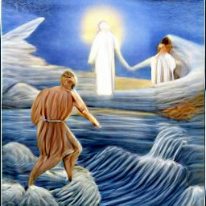
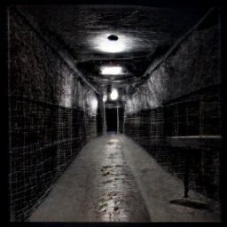
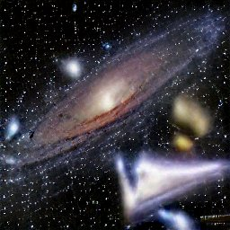
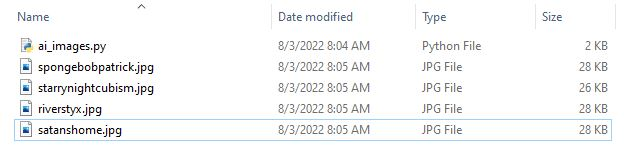

# AI-Image-Bot
Sends a request to Craiyon AI Image Generator to generate 9 images in Base64 code from a chosen prompt. The program then parses and assembles the Base64 code into 9 JPG files outputted within the same directory.

<h4>Here are some examples:</h4> 

  
   
  
  
  
  
   
  
  
  
  

  

